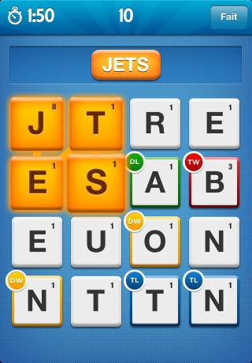

Ruzzle Solver
=============

Ce programme à été conçue dans le cadre d'un projet de seconde année de License SPI à l'Université du Maine - Le Mans

Ce programme à pour but de résoudre une grille du jeux pour smartphone Ruzzle : 

Il est possible d'utilisé ce programme soit : 
	* En CLI en passant dirrectement la chaine de caractère qui défini la grille
	
		> ruzzle_solver "V5  R1  L2  S1  T1  N1  I1  V5  C3MTL2  A1  R1  D2  E1  S1  E1  "
		
	* En entrent la chaine de caractère lorsqu'elle est demandée.

Auteurs : Ewen C. - Bastien 